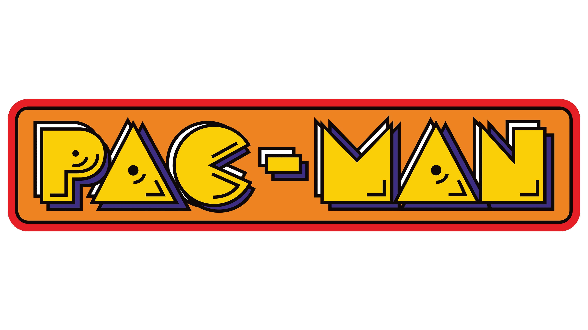

# Tech-Basics-1-Final-Project

Welcome, again! 👋  
This is the **final project** in the *Tech Basics 1* seminar from my university.🏁

This repository will guide you through the process of creating my final Python project for the Tech Basics 1 class. The goal is to develop a working 🎮**Pac-Man 2.0**🎮 game with appealing graphics and an enjoyable user experience.🕹️

If you'd like to follow the development process or reuse parts of it, feel free to browse through my upcoming uploads.👨‍💻👩‍💻

